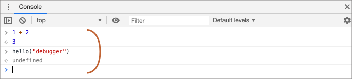

# Debugging in the browser

- [Debugging] is the process of finding and fixing errors within a script. All modern browsers and most other environments support debugging tools -- a special UI in developer tools that makes debugging much easier. It also allows to trace the code step by step to see what exactly is going on.


## The "Sources" panel

Your Chrome version may look a little bit different, but it still should be obvious what's there.

- Open the [example page](debugging/index.html) in Chrome.
- Turn on developer tools with `key:F12` (Mac: `key:Cmd+Opt+I`).
- Select the `Sources` panel.

Here's what you should see if you are doing it for the first time:


The toggler button <span class="devtools" style="background-position:-172px -98px"></span> opens the tab with files.

Let's click it and select `hello.js` in the tree view. Here's what should show up:


The Sources panel has 3 parts:

1. The **File Navigator** pane lists HTML, JavaScript, CSS and other files, including images that are attached to the page. Chrome extensions may appear here too.
2. The **Code Editor** pane shows the source code.
3. The **JavaScript Debugging** pane is for debugging, we'll explore it soon.


## Console

- If we press `key:Esc`, then a console opens below. We can type commands there and press `key:Enter` to execute. After a statement is executed, its result is shown below.

- For example, here `1+2` results in `3`, while the function call `hello("debugger")` returns nothing, so the result is `undefined`:



## Breakpoints

- A *breakpoint* is a point of code where the debugger will automatically pause the JavaScript execution. While the code is paused, we can examine current variables, execute commands in the console etc. In other words, we can debug it.

It should look like this (blue is where you should click):


## The command "debugger"

- We can also pause the code by using the `debugger` command in it. Such command works only when the development tools are open, otherwise the browser ignores it. 

```js
function hello(name) {
  let phrase = `Hello, ${name}!`;

*!*
  debugger;  // <-- the debugger stops here
*/!*

  say(phrase);
}
```

## Pause and look around

- In our example, `hello()` is called during the page load, so the easiest way to activate the debugger (after we've set the breakpoints) is to reload the page. So let's press `key:F5` (Windows, Linux) or `key:Cmd+R` (Mac).

As the breakpoint is set, the execution pauses at the 4th line:


Please open the informational dropdowns to the right (labeled with arrows). They allow you to examine the current code state:

1. **`Watch` -- shows current values for any expressions.**
    You can click the plus `+` and input an expression. The debugger will show its value, automatically recalculating it in the process of execution.

2. **`Call Stack` -- shows the nested calls chain.**
    At the current moment the debugger is inside `hello()` call, called by a script in `index.html` (no function there, so it's called "anonymous").
    If you click on a stack item (e.g. "anonymous"), the debugger jumps to the corresponding code, and all its variables can be examined as well.

3. **`Scope` -- current variables.**
    `Local` shows local function variables. You can also see their values highlighted right over the source.
    `Global` has global variables (out of any functions).
    There's also `this` keyword there that we didn't study yet, but we'll do that soon.

## Tracing the execution

- Now it's time to *trace* the script. There are buttons for it at the top of the right panel. Let's engage them.
<!-- https://github.com/ChromeDevTools/devtools-frontend/blob/master/front_end/Images/src/largeIcons.svg -->
<span class="devtools" style="background-position:-146px -168px"></span> -- "Resume": continue the execution, hotkey `key:F8`.
: Resumes the execution. If there are no additional breakpoints, then the execution just continues and the debugger loses control.

    Here's what we can see after a click on it:

    

<span class="devtools" style="background-position:-200px -190px"></span> -- "Step": run the next command, hotkey `key:F9`.
: Run the next statement. If we click it now, `alert` will be shown.

    Clicking this again and again will step through all script statements one by one.

<span class="devtools" style="background-position:-62px -192px"></span> -- "Step over": run the next command, but *don't go into a function*, hotkey `key:F10`.
: Similar to the previous "Step" command, but behaves differently if the next statement is a function call (not a built-in, like `alert`, but a function of our own).

    If we compare them, the "Step" command goes into a nested function call and pauses the execution at its first line, while "Step over" executes the nested function call invisibly to us, skipping the function internals. The execution is then paused immediately after that function call. That's good if we're not interested to see what happens inside the function call.

<span class="devtools" style="background-position:-4px -194px"></span> -- "Step into", hotkey `key:F11`.
: That's similar to "Step", but behaves differently in case of asynchronous function calls. If you're only starting to learn JavaScript, then you can ignore the difference, as we don't have asynchronous calls yet.

    For the future, just note that "Step" command ignores async actions, such as `setTimeout` (scheduled function call), that execute later. The "Step into" goes into their code, waiting for them if necessary.

<span class="devtools" style="background-position:-32px -194px"></span> -- "Step out": continue the execution till the end of the current function, hotkey `key:Shift+F11`.
: Continue the execution and stop it at the very last line of the current function. That's handy when we accidentally entered a nested call using <span class="devtools" style="background-position:-200px -190px"></span>, but it does not interest us, and we want to continue to its end as soon as possible.

<span class="devtools" style="background-position:-61px -74px"></span> -- enable/disable all breakpoints.
: That button does not move the execution. Just a mass on/off for breakpoints.

<span class="devtools" style="background-position:-90px -146px"></span> -- enable/disable automatic pause in case of an error.
: When enabled, if the developer tools is open, an error during the script execution automatically pauses it. Then we can analyze variables in the debugger to see what went wrong. So if our script dies with an error, we can open debugger, enable this option and reload the page to see where it dies and what's the context at that moment.
