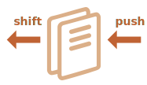

# Arrays

- It is not convenient to use an object here, because it provides no methods to manage the order of elements. We can’t insert a new property “between” the existing ones. Objects are just not meant for such use. There exists a special data structure named `Array`, to store ordered collections.

## Declaration

- There are two syntaxes for creating an empty array:

```js
let arr = new Array();
let arr = [];
```

- Almost all the time, the second syntax is used. We can supply initial elements in the brackets:

```js
let fruits = ["Apple", "Orange", "Plum"];
```

- Array elements are numbered, starting with zero. We can get an element by its number in square brackets:

```js run
let fruits = ["Apple", "Orange", "Plum"];

alert( fruits[0] ); // Apple
alert( fruits[1] ); // Orange
alert( fruits[2] ); // Plum
```

We can replace an element:

```js
fruits[2] = 'Pear'; // now ["Apple", "Orange", "Pear"]
```

...Or add a new one to the array:

```js
fruits[3] = 'Lemon'; // now ["Apple", "Orange", "Pear", "Lemon"]
```

The total count of the elements in the array is its `length`:

```js run
let fruits = ["Apple", "Orange", "Plum"];

alert( fruits.length ); // 3
```

We can also use `alert` to show the whole array.

```js run
let fruits = ["Apple", "Orange", "Plum"];

alert( fruits ); // Apple,Orange,Plum
```

An array can store elements of any type.

For instance:

```js run no-beautify
// mix of values
let arr = [ 'Apple', { name: 'John' }, true, function() { alert('hello'); } ];

// get the object at index 1 and then show its name
alert( arr[1].name ); // John

// get the function at index 3 and run it
arr[3](); // hello
```

## Get last elements with "at"

[recent browser="new"]

Let's say we want the last element of the array.

Some programming languages allow the use of negative indexes for the same purpose, like `fruits[-1]`.

Although, in JavaScript it won't work. The result will be `undefined`, because the index in square brackets is treated literally.

We can explicitly calculate the last element index and then access it: `fruits[fruits.length - 1]`.

```js run
let fruits = ["Apple", "Orange", "Plum"];

alert( fruits[fruits.length-1] ); // Plum
```

A bit cumbersome, isn't it? We need to write the variable name twice.

Luckily, there's a shorter syntax: `fruits.at(-1)`:

```js run
let fruits = ["Apple", "Orange", "Plum"];

// same as fruits[fruits.length-1]
alert( fruits.at(-1) ); // Plum
```

In other words, `arr.at(i)`:
- is exactly the same as `arr[i]`, if `i >= 0`.
- for negative values of `i`, it steps back from the end of the array.

## Methods pop/push, shift/unshift

- A [queue] is one of the most common uses of an array. In computer science, this means an ordered collection of elements which supports two operations:

- `push` appends an element to the end.
- `shift` get an element from the beginning, advancing the queue, so that the 2nd element becomes the 1st.



Arrays support both operations.

- In practice we need it very often. For example, a queue of messages that need to be shown on-screen. There's another use case for arrays -- the data structure named [stack]

It supports two operations:

- `push` adds an element to the end.
- `pop` takes an element from the end.

So new elements are added or taken always from the "end".

A stack is usually illustrated as a pack of cards: new cards are added to the top or taken from the top:


For stacks, the latest pushed item is received first, that's also called LIFO (Last-In-First-Out) principle. For queues, we have FIFO (First-In-First-Out).

Arrays in JavaScript can work both as a queue and as a stack. They allow you to add/remove elements, both to/from the beginning or the end.

In computer science, the data structure that allows this, is called [deque](https://en.wikipedia.org/wiki/Double-ended_queue).

**Methods that work with the end of the array:**

`pop`
: Extracts the last element of the array and returns it:

    ```js run
    let fruits = ["Apple", "Orange", "Pear"];

    alert( fruits.pop() ); // remove "Pear" and alert it

    alert( fruits ); // Apple, Orange
    ```

    Both `fruits.pop()` and `fruits.at(-1)` return the last element of the array, but `fruits.pop()` also modifies the array by removing it.

`push`
: Append the element to the end of the array:

    ```js run
    let fruits = ["Apple", "Orange"];

    fruits.push("Pear");

    alert( fruits ); // Apple, Orange, Pear
    ```

    The call `fruits.push(...)` is equal to `fruits[fruits.length] = ...`.

**Methods that work with the beginning of the array:**

`shift`
: Extracts the first element of the array and returns it:

    ```js run
    let fruits = ["Apple", "Orange", "Pear"];

    alert( fruits.shift() ); // remove Apple and alert it

    alert( fruits ); // Orange, Pear
    ```

`unshift`
: Add the element to the beginning of the array:

    ```js run
    let fruits = ["Orange", "Pear"];

    fruits.unshift('Apple');

    alert( fruits ); // Apple, Orange, Pear
    ```

Methods `push` and `unshift` can add multiple elements at once:

```js run
let fruits = ["Apple"];

fruits.push("Orange", "Peach");
fruits.unshift("Pineapple", "Lemon");

// ["Pineapple", "Lemon", "Apple", "Orange", "Peach"]
alert( fruits );
```

## Internals

- An array is a special kind of object. The square brackets used to access a property `arr[0]` actually come from the object syntax. That's essentially the same as `obj[key]`, where `arr` is the object, while numbers are used as keys.

For instance, it is copied by reference:

```js run
let fruits = ["Banana"]

let arr = fruits; // copy by reference (two variables reference the same array)

alert( arr === fruits ); // true

arr.push("Pear"); // modify the array by reference

alert( fruits ); // Banana, Pear - 2 items now
```

For instance, technically we can do this:

```js
let fruits = []; // make an array

fruits[99999] = 5; // assign a property with the index far greater than its length

fruits.age = 25; // create a property with an arbitrary name
```

The ways to misuse an array:

- Add a non-numeric property like `arr.test = 5`.
- Make holes, like: add `arr[0]` and then `arr[1000]` (and nothing between them).
- Fill the array in the reverse order, like `arr[1000]`, `arr[999]` and so on.

## Performance

- Methods `push/pop` run fast, while `shift/unshift` are slow.


Why is it faster to work with the end of an array than with its beginning? Let's see what happens during the execution:

```js
fruits.shift(); // take 1 element from the start
```

It's not enough to take and remove the element with the index `0`. Other elements need to be renumbered as well.

The `shift` operation must do 3 things:

1. Remove the element with the index `0`.
2. Move all elements to the left, renumber them from the index `1` to `0`, from `2` to `1` and so on.
3. Update the `length` property.


**The more elements in the array, the more time to move them, more in-memory operations.**

The similar thing happens with `unshift`: to add an element to the beginning of the array, we need first to move existing elements to the right, increasing their indexes.

And what's with `push/pop`? They do not need to move anything. To extract an element from the end, the `pop` method cleans the index and shortens `length`.

The actions for the `pop` operation:

```js
fruits.pop(); // take 1 element from the end
```


**The `pop` method does not need to move anything, because other elements keep their indexes. That's why it's blazingly fast.**

The similar thing with the `push` method.

## Loops

One of the oldest ways to cycle array items is the `for` loop over indexes:

```js run
let arr = ["Apple", "Orange", "Pear"];

*!*
for (let i = 0; i < arr.length; i++) {
*/!*
  alert( arr[i] );
}
```

But for arrays there is another form of loop, `for..of`:

```js run
let fruits = ["Apple", "Orange", "Plum"];

// iterates over array elements
for (let fruit of fruits) {
  alert( fruit );
}
```

The `for..of` doesn't give access to the number of the current element, just its value, but in most cases that's enough. And it's shorter.

Technically, because arrays are objects, it is also possible to use `for..in`:

```js run
let arr = ["Apple", "Orange", "Pear"];

*!*
for (let key in arr) {
*/!*
  alert( arr[key] ); // Apple, Orange, Pear
}
```

- Generally, we shouldn't use `for..in` for arrays.

## A word about "length"

- The `length` property automatically updates when we modify the array. To be precise, it is actually not the count of values in the array, but the greatest numeric index plus one.

For instance, a single element with a large index gives a big length:

```js run
let fruits = [];
fruits[123] = "Apple";

alert( fruits.length ); // 124
```

- Another interesting thing about the `length` property is that it's writable. If we increase it manually, nothing interesting happens. But if we decrease it, the array is truncated. The process is irreversible, here's the example:

```js run
let arr = [1, 2, 3, 4, 5];

arr.length = 2; // truncate to 2 elements
alert( arr ); // [1, 2]

arr.length = 5; // return length back
alert( arr[3] ); // undefined: the values do not return
```

So, the simplest way to clear the array is: `arr.length = 0;`.


## new Array() [#new-array]

There is one more syntax to create an array:

```js
let arr = *!*new Array*/!*("Apple", "Pear", "etc");
```

It's rarely used, because square brackets `[]` are shorter. Also, there's a tricky feature with it.

If `new Array` is called with a single argument which is a number, then it creates an array *without items, but with the given length*.

Let's see how one can shoot themselves in the foot:

```js run
let arr = new Array(2); // will it create an array of [2] ?

alert( arr[0] ); // undefined! no elements.

alert( arr.length ); // length 2
```

To avoid such surprises, we usually use square brackets, unless we really know what we're doing.

## Multidimensional arrays

- Arrays can have items that are also arrays. We can use it for multidimensional arrays, for example to store matrices:

```js run
let matrix = [
  [1, 2, 3],
  [4, 5, 6],
  [7, 8, 9]
];

alert( matrix[0][1] ); // 2, the second value of the first inner array
```

## toString

- Arrays have their own implementation of `toString` method that returns a comma-separated list of elements.

For instance:


```js run
let arr = [1, 2, 3];

alert( arr ); // 1,2,3
alert( String(arr) === '1,2,3' ); // true
```

Also, let's try this:

```js run
alert( [] + 1 ); // "1"
alert( [1] + 1 ); // "11"
alert( [1,2] + 1 ); // "1,21"
```

- Arrays do not have `Symbol.toPrimitive`, neither a viable `valueOf`, they implement only `toString` conversion, so here `[]` becomes an empty string, `[1]` becomes `"1"` and `[1,2]` becomes `"1,2"`.

```js run
alert( "" + 1 ); // "1"
alert( "1" + 1 ); // "11"
alert( "1,2" + 1 ); // "1,21"
```

## Don't compare arrays with ==

- Arrays in JavaScript, unlike some other programming languages, shouldn't be compared with operator `==`. This operator has no special treatment for arrays, it works with them as with any objects.

Let's recall the rules:

- Two objects are equal `==` only if they're references to the same object.
- If one of the arguments of `==` is an object, and the other one is a primitive, then the object gets converted to primitive, as explained in the chapter <info:object-toprimitive>.
- ...With an exception of `null` and `undefined` that equal `==` each other and nothing else.

The strict comparison `===` is even simpler, as it doesn't convert types.

So, if we compare arrays with `==`, they are never the same, unless we compare two variables that reference exactly the same array.

For example:
```js run
alert( [] == [] ); // false
alert( [0] == [0] ); // false
```

These arrays are technically different objects. So they aren't equal. The `==` operator doesn't do item-by-item comparison.

Comparison with primitives may give seemingly strange results as well:

```js run
alert( 0 == [] ); // true

alert('0' == [] ); // false
```

Here, in both cases, we compare a primitive with an array object. So the array `[]` gets converted to primitive for the purpose of comparison and becomes an empty string `''`.

Then the comparison process goes on with the primitives, as described in the chapter <info:type-conversions>:

```js run
// after [] was converted to ''
alert( 0 == '' ); // true, as '' becomes converted to number 0

alert('0' == '' ); // false, no type conversion, different strings
```

So, how to compare arrays?

That's simple: don't use the `==` operator. Instead, compare them item-by-item in a loop or using iteration methods explained in the next chapter.

